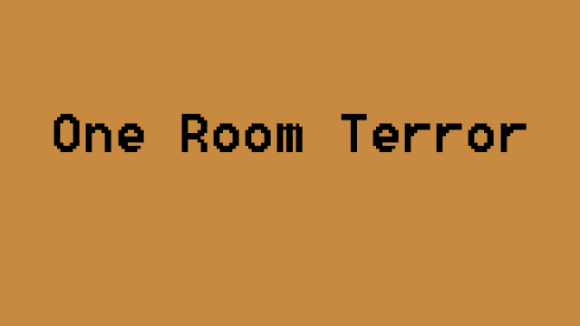

<p align="center">
    
</p>

## Description
Coming soon!

### Stack
[](https://nodejs.org/en/)
[](https://phaser.io/)

# Install and run
```
(Make sure that you have Node.js and npm)
$ npm install -g http-server
$ http-server
```

# Go to (use any below)
- http://localhost:8080/
- http://192.168.56.1:8080
- http://192.168.1.29:8080
- http://127.0.0.1:8080

# If stuff doesn't work right
- Control + Shift + R (Command + Shift + R)
- Go to the settings and clear your cache
